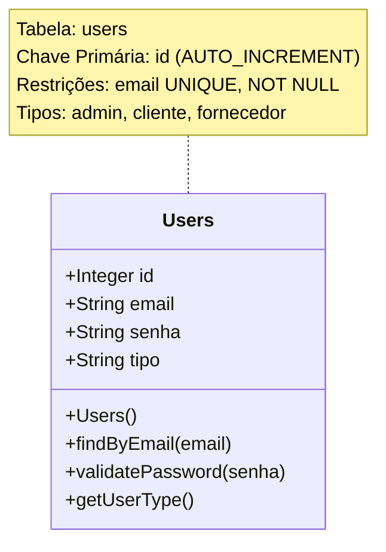

# Diagrama de Classes - Banco de Dados AgendaLog

## Estrutura Atual do Banco de Dados

Baseado na análise do projeto, o banco de dados atualmente possui apenas uma tabela principal:

### Tabela: users



## Estrutura Expandida Sugerida

Para um sistema completo de agendamento e logística, sugiro a seguinte estrutura expandida:

```mermaid
classDiagram
    class Users {
        +Integer id
        +String email
        +String senha
        +String tipo
        +String nome
        +String telefone
        +DateTime createdAt
        +DateTime updatedAt
        
        +Users()
        +findByEmail(email)
        +validatePassword(senha)
        +getUserType()
    }
    
    class Agendamentos {
        +Integer id
        +Integer userId
        +String titulo
        +String descricao
        +DateTime dataHora
        +String status
        +String localizacao
        +DateTime createdAt
        +DateTime updatedAt
        
        +Agendamentos()
        +createAgendamento()
        +updateStatus()
        +cancelarAgendamento()
    }
    
    class Pedidos {
        +Integer id
        +Integer clienteId
        +Integer fornecedorId
        +String numeroPedido
        +String descricao
        +Decimal valor
        +String status
        +DateTime dataPedido
        +DateTime dataEntrega
        +DateTime createdAt
        +DateTime updatedAt
        
        +Pedidos()
        +createPedido()
        +updateStatus()
        +calcularValor()
    }
    
    class Produtos {
        +Integer id
        +String nome
        +String descricao
        +Decimal preco
        +Integer estoque
        +String categoria
        +DateTime createdAt
        +DateTime updatedAt
        
        +Produtos()
        +updateEstoque()
        +getPreco()
    }
    
    class ItemPedido {
        +Integer id
        +Integer pedidoId
        +Integer produtoId
        +Integer quantidade
        +Decimal precoUnitario
        +Decimal subtotal
        +DateTime createdAt
        
        +ItemPedido()
        +calcularSubtotal()
    }
    
    class Logs {
        +Integer id
        +String nivel
        +String mensagem
        +String origem
        +JSON metadata
        +DateTime timestamp
        
        +Logs()
        +createLog()
        +getLogsByLevel()
    }
    
    %% Relacionamentos
    Users ||--o{ Agendamentos : "possui"
    Users ||--o{ Pedidos : "cliente faz"
    Users ||--o{ Pedidos : "fornecedor atende"
    Pedidos ||--o{ ItemPedido : "contém"
    Produtos ||--o{ ItemPedido : "incluído em"
    
    note for Users "Tipos: admin, cliente, fornecedor"
    note for Agendamentos "Status: agendado, confirmado, cancelado, concluído"
    note for Pedidos "Status: pendente, aprovado, em_producao, enviado, entregue, cancelado"
    note for ItemPedido "Tabela de junção entre Pedidos e Produtos"
```

## Detalhamento das Tabelas

### 1. Users (Atual)
- **id**: Chave primária auto-incremento
- **email**: Email único do usuário
- **senha**: Senha criptografada
- **tipo**: Tipo de usuário (admin, cliente, fornecedor)

### 2. Agendamentos (Sugerida)
- **id**: Chave primária
- **userId**: Chave estrangeira para Users
- **titulo**: Título do agendamento
- **descricao**: Descrição detalhada
- **dataHora**: Data e hora do agendamento
- **status**: Status atual (agendado, confirmado, cancelado, concluído)
- **localizacao**: Local do agendamento

### 3. Pedidos (Sugerida)
- **id**: Chave primária
- **clienteId**: Chave estrangeira para Users (cliente)
- **fornecedorId**: Chave estrangeira para Users (fornecedor)
- **numeroPedido**: Número único do pedido
- **descricao**: Descrição geral do pedido
- **valor**: Valor total do pedido
- **status**: Status do pedido
- **dataPedido**: Data de criação do pedido
- **dataEntrega**: Data prevista de entrega

### 4. Produtos (Sugerida)
- **id**: Chave primária
- **nome**: Nome do produto
- **descricao**: Descrição do produto
- **preco**: Preço unitário
- **estoque**: Quantidade em estoque
- **categoria**: Categoria do produto

### 5. ItemPedido (Sugerida)
- **id**: Chave primária
- **pedidoId**: Chave estrangeira para Pedidos
- **produtoId**: Chave estrangeira para Produtos
- **quantidade**: Quantidade do produto
- **precoUnitario**: Preço unitário no momento do pedido
- **subtotal**: Valor total do item

### 6. Logs (Sugerida)
- **id**: Chave primária
- **nivel**: Nível do log (ERROR, WARN, INFO, DEBUG)
- **mensagem**: Mensagem do log
- **origem**: Origem do log (controller, service, etc.)
- **metadata**: Dados adicionais em JSON
- **timestamp**: Data e hora do log

## Relacionamentos

1. **Users → Agendamentos**: Um usuário pode ter vários agendamentos
2. **Users → Pedidos (Cliente)**: Um cliente pode fazer vários pedidos
3. **Users → Pedidos (Fornecedor)**: Um fornecedor pode atender vários pedidos
4. **Pedidos → ItemPedido**: Um pedido pode conter vários itens
5. **Produtos → ItemPedido**: Um produto pode estar em vários pedidos

## Considerações Técnicas

- Todas as tabelas sugeridas incluem timestamps (createdAt, updatedAt)
- Uso de chaves estrangeiras para manter integridade referencial
- Campos de status para controle de fluxo
- Campos monetários usando DECIMAL para precisão
- Sistema de logs estruturado para auditoria

## Próximos Passos

Para implementar a estrutura expandida:

1. Criar migrations do Sequelize para as novas tabelas
2. Implementar os modelos Sequelize correspondentes
3. Criar relacionamentos entre os modelos
4. Implementar controllers e services para cada entidade
5. Criar rotas da API para CRUD completo
6. Implementar validações e middlewares específicos
