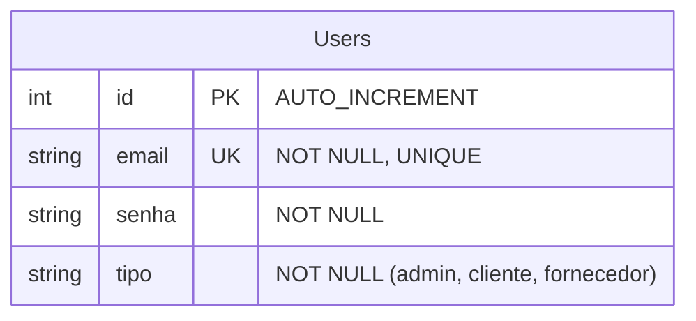
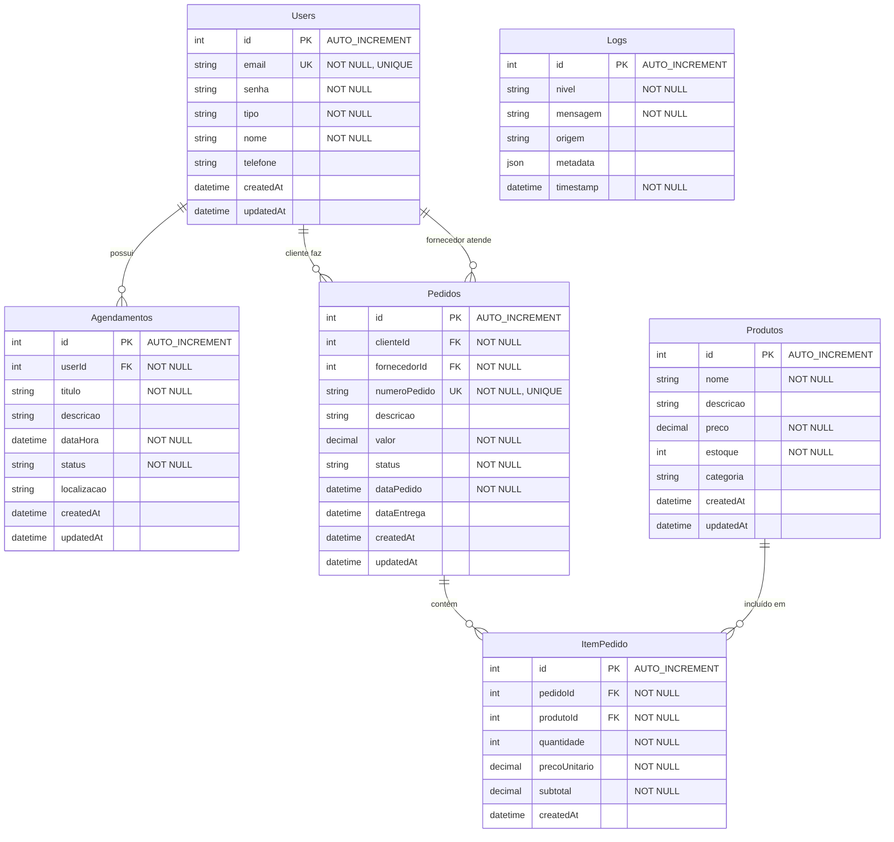

# Diagrama de Classes - Banco de Dados AgendaLog

## Estrutura Atual (Implementada)

## Estrutura Expandida  (que sera feita)

## Legenda dos Tipos de Usuário

- **admin**: Acesso completo ao sistema
- **cliente**: Pode fazer pedidos e agendamentos
- **fornecedor**: Pode atender pedidos e agendamentos

## Status dos Agendamentos

- **agendado**: Agendamento criado, aguardando confirmação
- **confirmado**: Agendamento confirmado pelo fornecedor
- **cancelado**: Agendamento cancelado
- **concluído**: Agendamento finalizado

## Status dos Pedidos

- **pendente**: Pedido criado, aguardando aprovação
- **aprovado**: Pedido aprovado pelo fornecedor
- **em_producao**: Pedido em produção
- **enviado**: Pedido enviado para entrega
- **entregue**: Pedido entregue ao cliente
- **cancelado**: Pedido cancelado

## Níveis de Log

- **ERROR**: Erros críticos
- **WARN**: Avisos importantes
- **INFO**: Informações gerais
- **DEBUG**: Informações detalhadas para debugging
